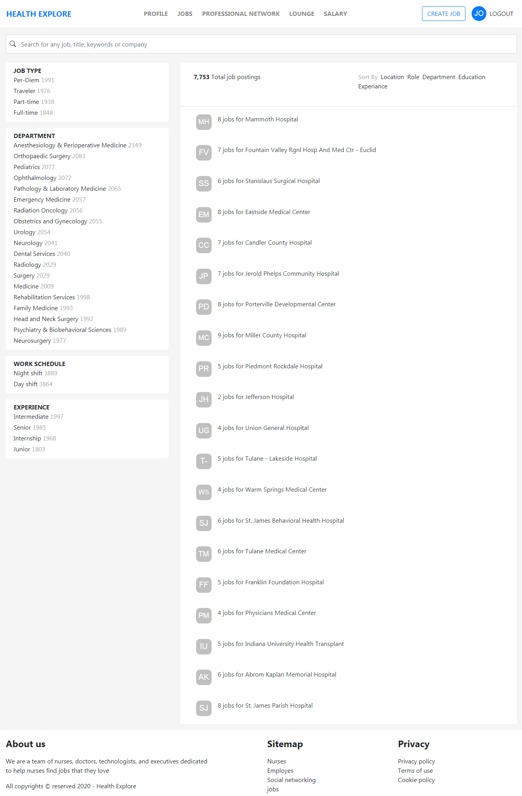
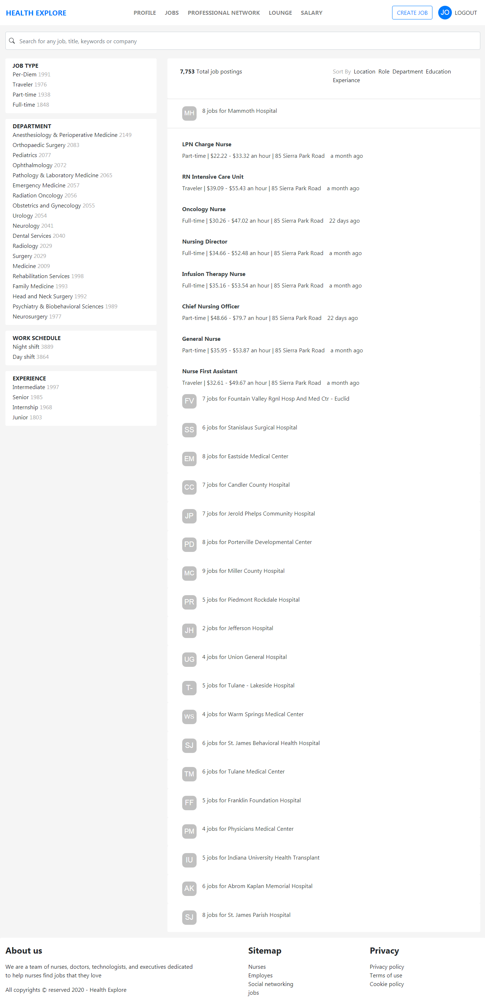
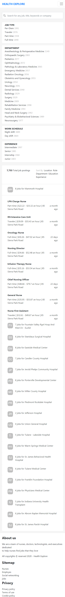

This is a [Next.js](https://nextjs.org/) project bootstrapped with [`create-next-app`](https://github.com/vercel/next.js/tree/canary/packages/create-next-app).

## Getting Started

First, run the development server:

```bash
npm run dev
# or
yarn dev
```

Open [http://localhost:3000](http://localhost:3000) with your browser to see the result.

You can start editing the page by modifying `pages/index.js`. The page auto-updates as you edit the file.

## Following activities has been taken care 

- Responsive UI/UX updated
- Created Restful API ( jobs.json & filter.json)
- Displayed API response on pageview
- Added filter 
- Added sorting based on sort type with ASC and DSC
- Added react bootstrap

## Technical Stacks
- NextJS
- React bootstrap
- Loadash
- Moment
- React Avtar
- Github with Vercel

## Learn More

To learn more about Next.js, take a look at the following resources:

- [Next.js Documentation](https://nextjs.org/docs) - learn about Next.js features and API.
- [Learn Next.js](https://nextjs.org/learn) - an interactive Next.js tutorial.

You can check out [the Next.js GitHub repository](https://github.com/vercel/next.js/) - your feedback and contributions are welcome!

## Deploy on Vercel

The easiest way to deploy your Next.js app is to use the [Vercel Platform](https://vercel.com/import?utm_medium=default-template&filter=next.js&utm_source=create-next-app&utm_campaign=create-next-app-readme) from the creators of Next.js.

Check out our [Next.js deployment documentation](https://nextjs.org/docs/deployment) for more details.

## Demo public URL
Open [https://entrust-biswajit-jena-2020-11-27.vercel.app/] You can see the output with your browser.

## Demo Screenshots
- Detailed List



- Expanded View



- Mobile Responsive View



